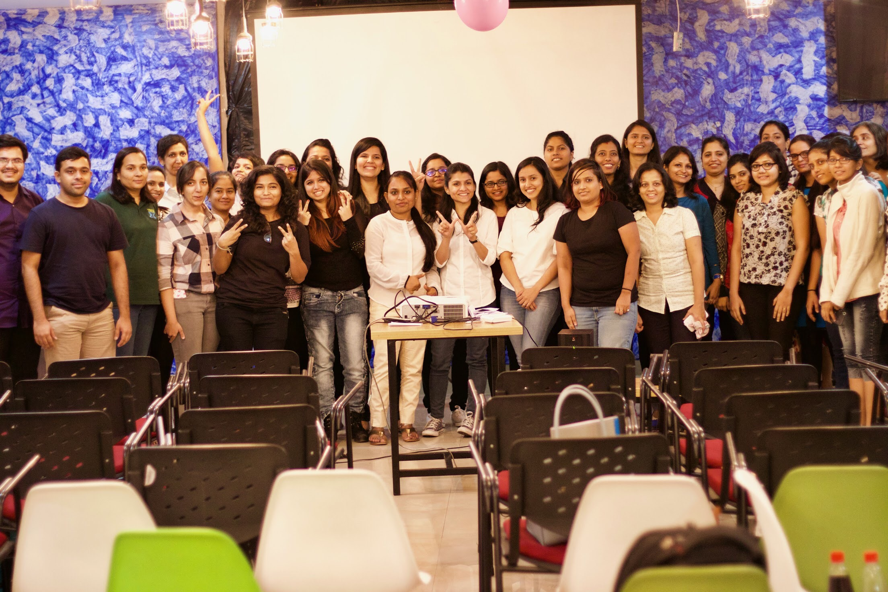

#Who are we?

We are community of women working in Tech companies dedicated to inspiring women to excel in their careers. We envision a world where women are representative as software engineers, technical executives, founders, VCs, board members, and lot more. Our workshops are designed to get you there.

#Who should join?

Our community is for any age group of women interested in learning how to code, including any one from students, underprivileged women,  Software engineers, UX/UI designers, Data scientists, Business analysts and more. This platform will bring women who by virtue of who they are, their beliefs, their actions and their personal power can encourage, enable and influence other women to reach their potential, harness their beliefs and become the best version of themselves. Anyone and everyone with similar purpose is welcome!

#Why this initiative?

As most of us might have experienced, women often have all the requisite skills, though there’s no ability gap, but there’s often a yawning confidence gap . It has been observed that we women are quieter in meetings even when we have an idea, fearing that we would say something stupid, if only we’d been braver. Even in meetups and conferences, you can certainly spot the difference in the comfort level. When it’s an all girls meetup, both speakers and audience seem very comfortable but  that sense of comfort is majorly missing when there are fewer women in the audience. And that’s what led us to make an effort to bring a change to gain more confidence, get more comfortable and grow together with this community. 
We often look at being part of communities as a philanthropy, a form of charity. But we do believe we should find ways to grow with a community, so there is value for everyone. We need to have more of these  to encourage women to step up and take responsibility, step up and run a team, step up and lead. All women should have the self-belief to put themselves forward and make their voices heard. Eventually more women will thrive across the board. How else will we inspire the next generation of women if we don’t set the examples ourselves? 

#What to expect?

- We help you build the skills you need to raise your professional profile and achieve greater career success.
- Provide opportunities for members to improve their coding, management, leadership, organizational and presentation skills through exchange of helpful information and involvement in activities.
- Learn how to overcome fear of failure and succeed. Discuss challenges for women to grow in leadership positions. And most importantly celebrate success of women by supporting and motivating each other.
- Our workshop includes free hands on technical talks,  group discussions, lightning talks and keynotes featuring influential women leaders in respective fields. 
- We also organize fun based activities to know each other better. Have lunch sessions with Ladies in Leadership or as crazy as Ladies night!  Each member provides references and get references from other member which helps us grow together.
