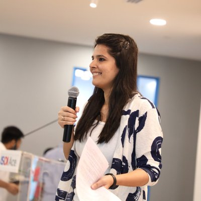
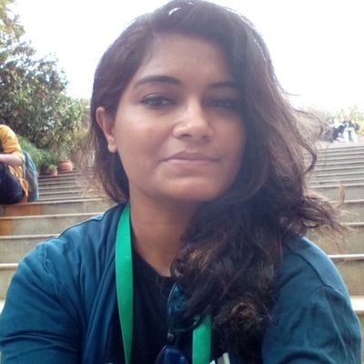
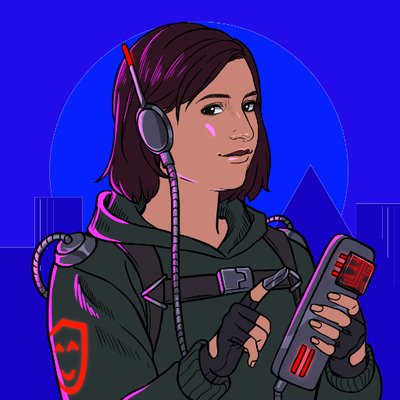

- #Arwa Lokhandwala
  

  Senior Full Stack Dev [@BookMyShow](https://twitter.com/BookMyShow), ex [@Jio](https://twitter.com/Jio), Co-organizer [@WomenCoders01](https://twitter.com/WomenCoders01), Writer [@geekabyte_info](https://twitter.com/geekabyte_info), [@usejournal](https://twitter.com/usejournal), Speaker

- #Disha Mourya
  
  
  Android Developer @gojek, previously Shaadi.com, AAD, Udacian, WomenInTech, Co-organizer of @WomenCoders01 Tech lead @wwcodemumbai

  I am an Android girl, in a developer wooorld 🎵 doing [@reactnative](https://twitter.com/reactnative) these days 🖥️📲 Working at [@curvetomorrow](https://twitter.com/curvetomorrow) a kick-ass startup 💁 with amazing people 😊😊

- #Honey Sonwani
  

  Android Developer, Organiser at Kotlin UG Mumbai, Co-organiser at Firebase Community

- #Dipti Gandhi
  

  Front-end Developer, on a journey to be a Compassionate Coder, Javascript lover, Co-organizer [@WomenCoders01](https://twitter.com/WomenCoders01), Freelancer.
  
  - #Manjula Dube
  

  Senior Eng,Mentor,Next Gig:TBA,Organiser [@react_india](https://twitter.com/react_india) [@WomenCoders01](https://twitter.com/WomenCoders01) [@gdgberlin](https://twitter.com/gdgberlin). Teaching [@CodeUniversity](https://twitter.com/CodeUniversity) [@LeWagonBerlin](https://twitter.com/LeWagonBerlin) ex [@bookmyshow](https://twitter.com/bookmyshow) OSS [@linaframework](https://twitter.com/linaframework)
